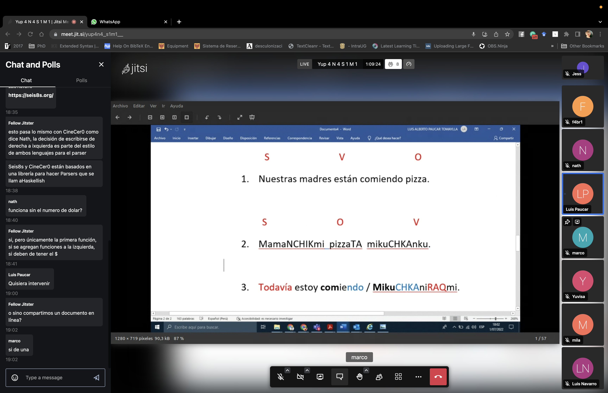
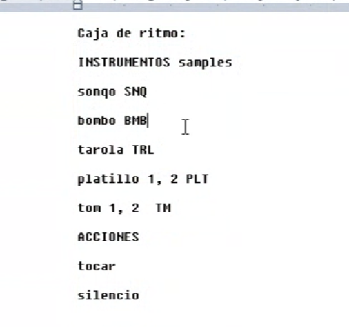
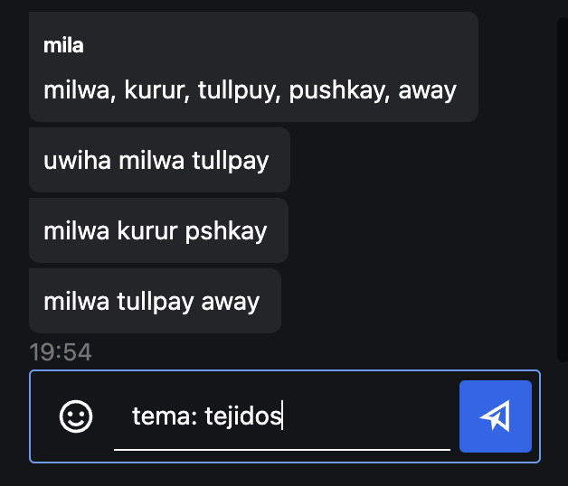
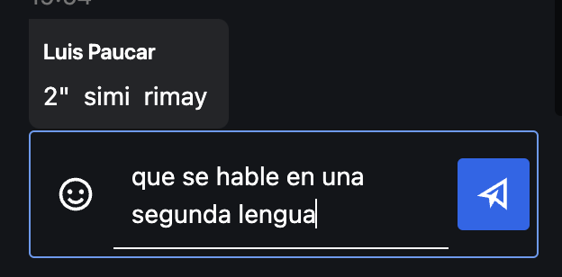
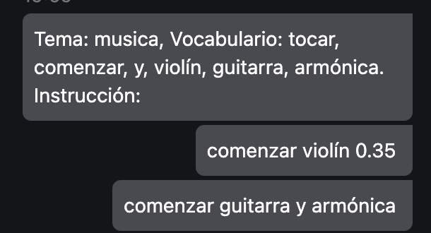

+ [Grabación](https://nas.sr/%D9%82%D9%84%D8%A8/](https://www.youtube.com/watch?v=tdtEiVgIQe8)

# PARTE 1 - DISEÑO DE LENGUAJES

+ Léxico - vocabulario
+ Sintáxis - modos de combinación de vocabulario, así como las relaciones entre las funciones y las acciones.
+ Semántica - significado de expresiones del lenguaje más allá de una capa universal, es más específico y tiene una relación abstracta entre la idea y la acción.
+ Ejemplo con Seis8s [https://seis8s.org/](https://seis8s.org/)
  + Léxico: sustantivos, números, y signos
  + Sintásix: se escribe de derecha a izquierda, hay unas funciones que tienen parámetros como ritmo 1, este recibe un instrumento (ejemplo: ritmo 1 teclado), etc...
  + Semántica: ligado a ritmos latinos, por ejemplo la función "tumbao" que está relacionado a la práctica musical en la cumbia. El tumbao está conectado con otras funciones como es el estilo musica (tumabo cumbia). Es la relación que existe con estilos musicales específicos e instrumentos.
+ Podemos poner nuestras propias reglar cuando diseñamos/implementamos un lenguaje de programación, eleguir vocabulario, las combinaciones, las puntuaciones posibles, la manera en la que se lee/escribe, etc...
+ Otros ejemplos:
  + [Ramsey Nasser: قلب](https://nas.sr/%D9%82%D9%84%D8%A8/)

+ Algunos comentarios o ideas generales:
  + un lenguaje basado en la entonación
  + un lenguaje basado en el origen de las palabras
  + conectar el lenguaje escrito con el lenguaje hablado... cómo escribimos lo que hablamos? gramaticálmente correcto? o también escribir como se escucha (ejemplo con el leguaje seis8s y la función güira que también se escribe como guira).
  + Tal vez puede ser un lenguaje inclusivo

+ Luis Paucar, ideas generales del Quechua y reflexiones:
  + No hay genero gramatical sino una única palabra.
  + A esa palabra se le agrega un prefijo para indicar género.
  + A veces el género se refleja en una palabra completamente diferentes. Por ejemplo wayna (jóven), sipa (mújer jóven).
  + También para decir otro tipo de especificidad o adjetivo.
  + Al objeto que se le marca algo se le agrega un TA.
  + El proceso de la información, o se procesa la idea de derecha a izquierda.
  + Hay algunas palabra que son exclusivas de algunas acciones. Por ejemplo "llevar", dependiendo del sustantivo, el verbo cambia.
  + Estructura aglutinante, todo está pegado.
  + Lo morfológico y sintáxis están unido a veces (como el segundo ejemplo). El sufijante.
  + Los verbos tienen sus conjugaciones.

Sujeto + Verbo + Objeto  
+ Nuestras madres están comiendo pizza  
+ Todavía estoy comiendo  
  
Sujeto + Objeto + Verbo  
+ MamaNCHIKmi pizzaTA mikuCHKAnku  
+ MikuCHKAniRAQmi  
 
## Ejercicio
1. Pensar un tema para un lenguaje de programación.
2. Pensar 5 palabras que estaría incluidas.
3. Escribir una frase simple con esas 5 palabras.

 
 
 

# PARTE 2 - DISEÑO DE LENGUAJES

+ Una vez bocetado el Léxico y la Sintaxis, podemos comenzar a bocetar la Semántica y la relación entre texto y acción.
+ Hay varias formas de hacer lo anterior pero la que yo comparto es la siguiente:
+ Ejemplo: JSoLang [Escuchar](https://github.com/jac307/MEMORIAS/tree/master/esolangs/Escuchar) del proyecto Memorias
  + Está basado en estructuras poéticas
  + Parsea funciones del lenguaje CineCer0, entonces la sintaxis es muy parecida, se lee de izquierda a derecha
  + [Aquí](https://github.com/jac307/MEMORIAS/blob/master/esolangs/Escuchar/Escuchar_cheatsheet.pdf) se puede ver el diccionario de funciones disponibles.
  + El diccionario está presentado en el orden que se pueden escribir las funciones para que tenga una aparente secuencia en términos poéticos
  + El lenguaje tiene intervenciones del lenguaje a través de símbolos y sígnos.
  + La estructura mínima es: imagen + sustantivo (ex. textos: cuartos = reproduce un video, imágenes: "esta soy yo" = visualiza un texto)
  + las transformaciones se agregan antes de esta estructura mínima (ex. extrañas 0.5 $ textos: cuartos = cambia la opacidad del video)
+ En el diseño de lenguajes de programación, ustedes pueden decidir sus propias reglas.
+ Consideraciones para nuestro lenguaje:
  + Tendremos intervenciones con símbolos y números?
  + No queremos reproducir lenguajes naturales sino crear una hibridación entre lenguajes naturales y computacionales
  + el vocabulario, cómo está ligado a la acción que produce la computadora?
  + Queremos tener opciones de escritura de palabras? Por ejemplo, que algo que se deletrea incorrectamente sea parte del vocabulario
  + Cómo involucrar la morfología del Quechua en nuestro lenguaje?
  + Trabajar desde la idea de la raíz, con prefijos y sufijos.

## Ejercicio para la siguiente sesión
Vamos a trabajar en equipos con los siguientes dos lenguajes:  
 
  
1. Reunirse
3. Bocetar un diccionario - conexiones entre el vocabulario y la función/acción que realizarían.
4. Vamos a bocetar este diccionario basándonos en la estructura y sintaxis de CineCer0.
5. Bocetar también de dos a tres oraciones válidas y qué esperan que producirían.
  
Ejemplo  
  
Estrutura de CineCer0: transformación 0.5 $ video url  
  
Estructura propuesta por Marco en su lenguaje: munayki muchawanki  
  
Diccionario basado en CineCer0:  
+ muna = setOpacity 0.5 --o-- muna = setOpacity 0.5 
+ y = (espacio vacío)
+ ki  = $
+ mucha  = video
+ wanki  = "url"
  
Estructura de nuestro nuevo lenguaje:  
+ munayki muchawanki --- reproducir un video con una opacidad tal = parámetro de opacidad integrado
--o--   
+ muna(0.5)yki muchawanki --- reproducir un video con una opacidad tal = parámetro de opacidad otorgado cuando se escribe

