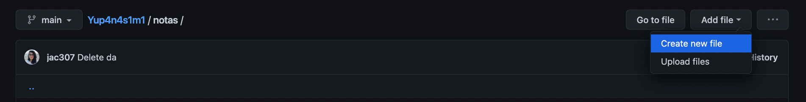
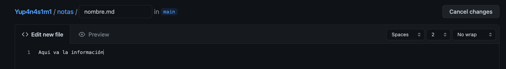
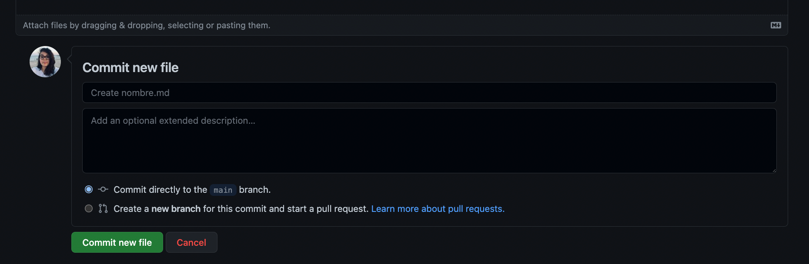
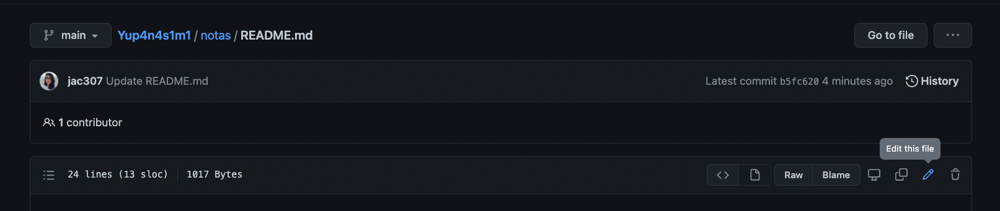
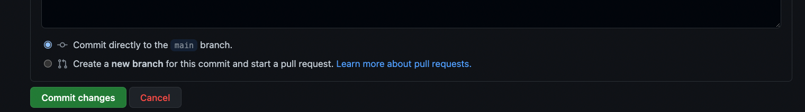
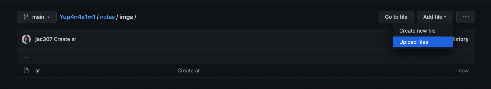
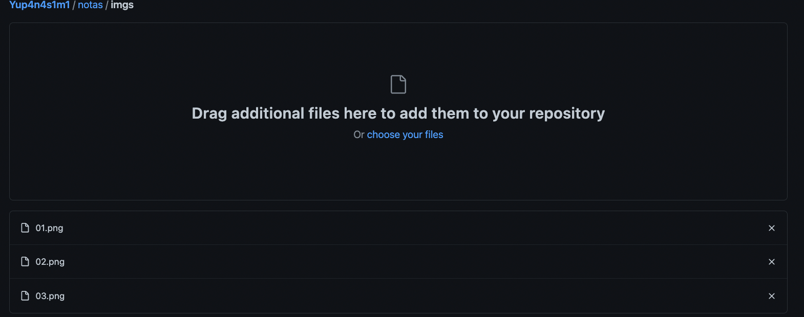
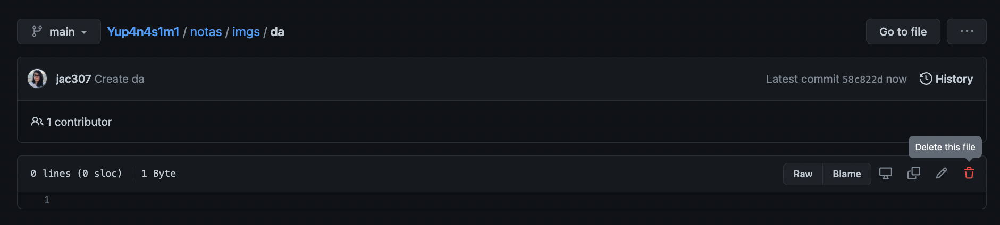
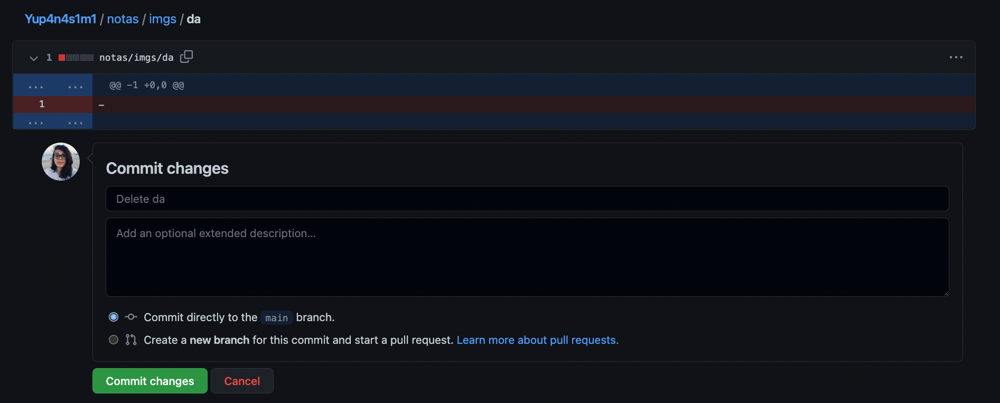

# Tutorial GitHub

## Agregar un nuevo archivo de texto

1. Entrar a la carpeta donde se quiere agregar el archivo de texto
2. Seleccionar "Add File" / "Añadir archivo"
3. Seleccionar "Create new file" / "Crear nuevo archivo"

5. En la nueva ventana, ocupar la casilla para agregar el nombre
      + Formato: nombre.md - se tiene que añadir la extensión .md
6. Agrega la información
      + Añadir información en la caja de texto donde dice: "Edit new file" / "Editar nuevo archivo"
      + Para conocer más sobre el formato: [Markdown](https://www.markdownguide.org/basic-syntax/) 

7. Ir al final de la páguina, presionar "Commit new file" / "Enviar nuevo archivo"

## Modificar archivo de texto

1. Seleccionar / Entrar al archivo que se quiere modificar
2. Presionar en la parte derecha el ícono de lapiz, este se llama "Edit this file" / "Editar este archivo".

4. Agrega/Modifica información.
5. Al finalizar presiona el botón verde para enviar cambios.

## Agregar archivo de media: videos, audios, imágenes, pdfs, y otros documentos
1. Entrar a la carpeta donde se quiere agregar el archivo de media
2. 2. Seleccionar "Add File" / "Añadir archivo"
3. Seleccionar "Upload Files" / "Subir archivos"

4. Añade los archivos
5. Espera a que se complete la subida

7. Al finalizar presiona el botón verde para enviar cambios.

## Borrar archivos
1. Selecciona / Entra al archivo que quieras borrar
2. Presiona el ícono de bote de basura que lleva el nombre de "Delete this file" / "Borrar este archivo"

3. Envía los cambios presionando el botón verde

